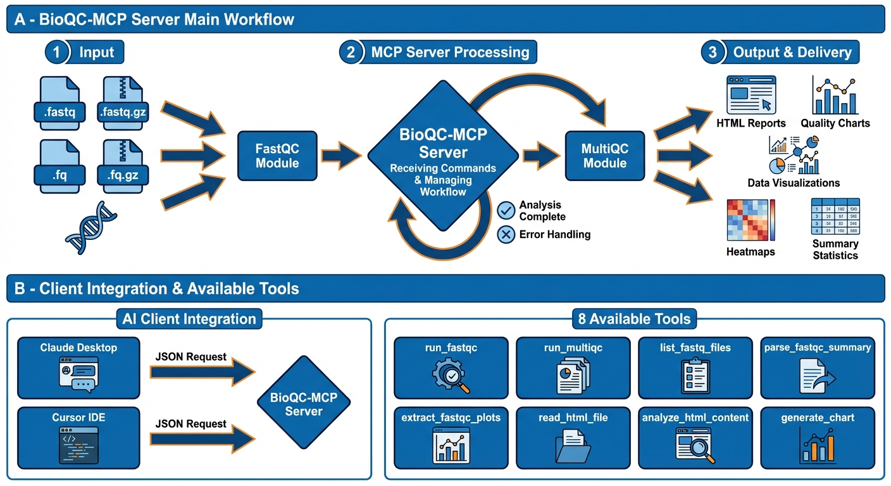

# FastQC & MultiQC MCP Server

A professional Model Context Protocol (MCP) server for comprehensive bioinformatics quality control analysis. This server provides automated QC pipeline execution, HTML report analysis, and advanced data visualization for sequencing data.

[](https://www.python.org/downloads/)
[](https://github.com/modelcontextprotocol)
[](LICENSE)
[]()

## 🚀 Quick Start

```bash
# 1. Clone and setup
git clone https://github.com/YOUR_USERNAME/fastqc-multiqc-mcp-server.git
cd fastqc-multiqc-mcp-server
python3 -m venv venv
source venv/bin/activate
pip install -r requirements.txt

# 2. Install prerequisites
brew install fastqc          # macOS
pip install multiqc

# 3. Test the server
./tests/test_mcp_server.sh

# 4. Configure in Claude/Cursor (see below)
```

---

## 📋 Overview

This MCP server provides 8 specialized tools for bioinformatics quality control:

1. **run_fastqc** - Execute FastQC analysis on FASTQ files
2. **run_multiqc** - Generate MultiQC aggregate reports
3. **list_fastq_files** - Auto-detect FASTQ files in directories
4. **parse_fastqc_summary** - Extract quality metrics
5. **extract_fastqc_plots** - Retrieve plot data
6. **read_html_file** - Read FastQC/MultiQC HTML reports
7. **analyze_html_content** - Parse HTML structure and data
8. **generate_chart** - Create custom visualizations (20+ chart types)

**Key Capabilities:**
- Automated quality control workflows
- HTML report interpretation
- Advanced visualization (line, bar, scatter, heat map, violin, box plots, etc.)
- Publication-quality chart generation
- Multi-sample analysis and aggregation

### 🔄 Workflow




---

## 📦 Installation

### Prerequisites

**Required:**
- Python 3.8+
- FastQC
- MultiQC

**Install Commands:**
```bash
# macOS
brew install fastqc
pip install multiqc

# Linux (Ubuntu/Debian)
sudo apt-get install fastqc
pip install multiqc

# Verify installation
fastqc --version
multiqc --version
```

### Setup

```bash
# Clone repository
git clone https://github.com/YOUR_USERNAME/fastqc-multiqc-mcp-server.git
cd fastqc-multiqc-mcp-server

# Create virtual environment
python3 -m venv venv
source venv/bin/activate  # Windows: venv\Scripts\activate

# Install Python dependencies
pip install -r requirements.txt

# Verify setup
./tests/test_mcp_server.sh
```

---

## ⚙️ Configuration

### Claude Desktop

Edit `~/Library/Application Support/Claude/claude_desktop_config.json`:

```json
{
  "mcpServers": {
    "fastqc-multiqc": {
      "command": "/FULL/PATH/TO/venv/bin/python3",
      "args": ["/FULL/PATH/TO/fastqc-multiqc-mcp-server/src/server.py"]
    }
  }
}
```

**Replace `/FULL/PATH/TO/` with your actual installation path.**

Restart Claude Desktop after saving.

### Cursor IDE

**Option 1: Quick Setup**
```bash
# Copy example config
mkdir -p ~/Library/Application\ Support/Cursor/User/globalStorage
cp examples/cursor-mcp-config.json ~/Library/Application\ Support/Cursor/User/globalStorage/mcp.json

# Edit the file and update paths to your installation
# Then restart Cursor (⌘Q and reopen)
```

**Option 2: Manual Setup**

Edit or create `~/Library/Application Support/Cursor/User/globalStorage/mcp.json`:

```json
{
  "mcpServers": {
    "fastqc-multiqc": {
      "command": "/FULL/PATH/TO/venv/bin/python3",
      "args": ["/FULL/PATH/TO/fastqc-multiqc-mcp-server/src/server.py"],
      "env": {
        "PATH": "/usr/local/bin:/opt/homebrew/bin:${PATH}",
        "PYTHONUNBUFFERED": "1"
      }
    }
  }
}
```

**Restart Cursor** (⌘Q and reopen) after saving.

**Verify:** Open Cursor AI chat and ask: *"What MCP tools are available?"*

---

## 🧪 Testing

### Automated Verification
```bash
# Run all checks
./tests/test_mcp_server.sh
```

This verifies:
- Python environment
- Dependencies installed
- FastQC/MultiQC available
- Server syntax valid

### Manual MCP Protocol Test
```bash
# Test MCP protocol compliance
python3 tests/test_server_manually.py
```

### Interactive Testing with MCP Inspector
```bash
# Launch Inspector for interactive testing
./tests/launch_inspector.sh
```

Navigate to http://localhost:6274 and configure:
- Command: `/FULL/PATH/TO/venv/bin/python3`
- Arguments: `/FULL/PATH/TO/src/server.py`
- Click "Connect" to test tools interactively

---

## 💡 Usage Examples

### Quality Control Analysis
```
"Run FastQC analysis on sample1.fastq and sample2.fastq"
"Check the quality of all FASTQ files in ~/data/sequencing/"
"Create a MultiQC report for samples in ~/results/"
```

### Report Analysis
```
"Read the FastQC report at ~/results/sample_fastqc.html"
"What does the quality report say about adapter contamination?"
"Summarize the MultiQC report findings"
```

### Data Visualization
```
"Generate a line chart showing per-base quality scores"
"Create a bar chart comparing GC content across samples"
"Make a heatmap of quality metrics"
```

### Complete Workflow
```
"Analyze all FASTQ files in ~/data/, generate FastQC reports, 
create a MultiQC summary, and show me a chart of overall quality scores"
```

---

## 🛠️ Troubleshooting

### Tools Not Showing in Claude/Cursor

1. **Verify paths in config file**
   ```bash
   # Check Python path
   which python3  # After activating venv
   
   # Check server path
   ls -la src/server.py
   ```

2. **Re-run verification**
   ```bash
   ./tests/test_mcp_server.sh
   ```

3. **Check logs**
   - **Claude**: Check Developer console
   - **Cursor**: View > Developer > Toggle Developer Tools > Console

### FastQC/MultiQC Not Found

```bash
# Verify installation
which fastqc
which multiqc

# If not found, install
brew install fastqc  # macOS
pip install multiqc

# Check PATH in config
# Add to config JSON:
"env": {
  "PATH": "/usr/local/bin:/opt/homebrew/bin:${PATH}"
}
```

### Server Won't Start

```bash
# Check dependencies
pip install -r requirements.txt

# Test server directly
source venv/bin/activate
python3 src/server.py
# Should show MCP protocol output

# Check syntax
python3 -m py_compile src/server.py
```

### Permission Issues

```bash
# Make scripts executable
chmod +x tests/*.sh
chmod +x src/server.py
```

---

## 📂 Project Structure

```
fastqc-multiqc-mcp-server/
├── src/
│   ├── __init__.py
│   └── server.py              # Main MCP server
├── tests/                      # Testing utilities
│   ├── test_mcp_server.sh     # Automated verification
│   ├── test_server_manually.py# MCP protocol test
│   ├── test_real_fastqc.sh    # Real data test
│   └── launch_inspector.sh    # MCP Inspector launcher
├── examples/                   # Configuration examples
│   └── cursor-mcp-config.json
├── docs/                       # Additional documentation
│   ├── TESTING_WITH_INSPECTOR.md
│   ├── TESTING_COMPLETE.md
│   ├── DEPLOYMENT_CHECKLIST.md
│   └── COMPARISON_BIOINFOMCP.md
├── requirements.txt            # Python dependencies
├── CHANGELOG.md                # Version history
├── LICENSE                     # MIT License
└── README.md                   # This file
```

---

## 🔧 Technical Specifications

**MCP Protocol:** 2024-11-05  
**Python Version:** 3.8+  
**Server Version:** 2.0.0  

**Dependencies:**
- mcp >= 1.0.0 (Model Context Protocol)
- pydantic >= 2.0.0 (data validation)
- matplotlib >= 3.8.0 (visualization)
- seaborn >= 0.13.0 (statistical graphics)
- plotly >= 5.18.0 (interactive charts)
- pandas >= 2.1.0 (data manipulation)
- numpy >= 1.24.0 (numerical computing)

**External Tools:**
- FastQC (quality control)
- MultiQC (report aggregation)

**Supported File Formats:**
- .fastq, .fq (uncompressed)
- .fastq.gz, .fq.gz (gzip compressed)

---

## 🎯 Features

### Quality Control Pipeline
- ✅ Single and batch FASTQ analysis
- ✅ Multi-sample aggregation
- ✅ Automatic file discovery
- ✅ Threaded execution support
- ✅ All standard sequencing formats

### Report Analysis
- ✅ HTML report parsing
- ✅ Structured data extraction
- ✅ Quality metrics interpretation
- ✅ Table and chart data extraction
- ✅ No browser required

### Visualization
- ✅ 20+ chart types
- ✅ Publication-quality output
- ✅ Custom styling and themes
- ✅ Multiple export formats
- ✅ Interactive charts (Plotly)

---

## 📊 Tested & Verified

- ✅ MCP Protocol 2024-11-05 compliant
- ✅ Tested with real 2.5GB FASTQ files
- ✅ Claude Desktop integration (December 2025)
- ✅ Cursor IDE ready
- ✅ MCP Inspector validated
- ✅ All 8 tools functional
- ✅ Production ready

---

## 🚀 Deployment

### Share via GitHub

1. Create repository on GitHub
2. Push code:
   ```bash
   git remote add origin https://github.com/YOUR_USERNAME/fastqc-multiqc-mcp-server.git
   git branch -M main
   git push -u origin main
   ```
3. Add topics: `mcp-server`, `bioinformatics`, `fastqc`, `quality-control`

### Users Install:
```bash
git clone https://github.com/YOUR_USERNAME/fastqc-multiqc-mcp-server.git
cd fastqc-multiqc-mcp-server
./tests/test_mcp_server.sh  # Verify setup
# Then configure in Claude/Cursor
```

---

## 📄 License

MIT License - see [LICENSE](LICENSE) file for details.

---

## 🤝 Contributing

Contributions welcome! Please:
1. Fork the repository
2. Create a feature branch
3. Make your changes
4. Add tests if applicable
5. Submit a pull request

---

## 📧 Support

- **Issues**: GitHub Issues
- **Email**: bioinformatics.bb@gmail.com
- **Documentation**: See `docs/` directory for additional guides

---

## 🎓 Resources

- [Model Context Protocol](https://github.com/modelcontextprotocol)
- [FastQC Documentation](https://www.bioinformatics.babraham.ac.uk/projects/fastqc/)
- [MultiQC Documentation](https://multiqc.info/)
- [MCP Server Examples](https://github.com/modelcontextprotocol/servers)

---

**Version:** 2.0.0  
**Status:** Production Ready  
**Last Updated:** December 2025
